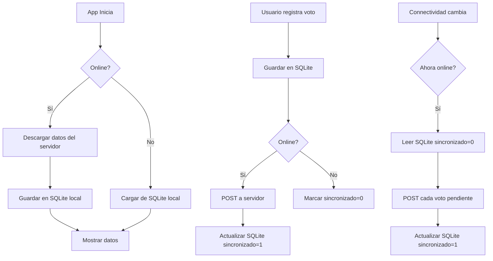

# 07 — GUÍA DE DESARROLLO FLUTTER (APP MÓVIL)

> Estándares, patrones y buenas prácticas para el desarrollo de la app móvil del ERP Electoral.

---

## 1. STACK TECNOLÓGICO

| Tecnología | Versión | Uso |
|-----------|---------|-----|
| Flutter | 3.x | Framework |
| Dart | >=3.0.0 | Lenguaje |
| Provider | 6.x | Estado global |
| sqflite | 2.x | SQLite local |
| connectivity_plus | 5.x | Detección de red |
| http | 1.x | Cliente REST |
| flutter_secure_storage | 9.x | Almacenamiento seguro |
| Material Design 3 | — | UI/UX |

---

## 2. ESTRUCTURA DEL PROYECTO

```
lib/
├── main.dart                        ← Entry point, providers, MaterialApp
│
├── config/
│   └── app_config.dart              ← Server URL, app name, version
│
├── theme/
│   └── app_theme.dart               ← Material 3 theme (seed color, scheme)
│
├── providers/
│   ├── app_provider.dart            ← Estado global (ChangeNotifier)
│   ├── auth_provider.dart           ← Login/logout, token
│   └── sync_provider.dart           ← Estado de sincronización
│
├── services/
│   ├── api_service.dart             ← Cliente REST (todos los endpoints)
│   ├── sync_service.dart            ← Lógica de sincronización offline
│   └── connectivity_service.dart    ← Escucha cambios de red
│
├── database/
│   └── database_helper.dart         ← SQLite singleton + migraciones
│
├── models/
│   ├── user_model.dart              ← Usuario + serialización
│   ├── eleccion_model.dart          ← Elección
│   ├── partido_model.dart           ← Partido político
│   ├── cargo_model.dart             ← Cargo
│   ├── candidato_model.dart         ← Candidato
│   ├── recinto_model.dart           ← Recinto electoral
│   ├── mesa_model.dart              ← Mesa electoral
│   └── voto_model.dart              ← Voto
│
├── screens/
│   ├── login_screen.dart            ← Login con gradiente + config servidor
│   ├── home_screen.dart             ← Dashboard + mesas asignadas + admin
│   ├── votacion_screen.dart         ← Registro de votos
│   ├── zonas_screen.dart            ← CRUD Zonas
│   ├── provincias_screen.dart       ← CRUD Provincias
│   ├── cantones_screen.dart         ← CRUD Cantones
│   ├── parroquias_screen.dart       ← CRUD Parroquias
│   └── instituciones_screen.dart    ← CRUD Instituciones
│
├── widgets/
│   ├── stat_card.dart               ← Tarjeta de estadística
│   ├── loading_overlay.dart         ← Overlay de carga
│   ├── empty_state.dart             ← Estado sin datos
│   ├── gradient_app_bar.dart        ← AppBar con gradiente
│   ├── sync_indicator.dart          ← Indicador online/offline
│   ├── crud_list_tile.dart          ← ListTile con editar/eliminar
│   └── confirm_dialog.dart          ← Diálogo de confirmación
│
└── utils/
    ├── constants.dart               ← Constantes de la app
    └── validators.dart              ← Validaciones (cédula, email)
```

---

## 3. MODELOS — SERIALIZACIÓN

```dart
class Candidato {
  final int id;
  final int eleccionId;
  final int partidoId;
  final int cargoId;
  final int? listaId;
  final String nombres;
  final String apellidos;
  final String? cedula;
  final String tipo; // PRINCIPAL, SUPLENTE
  final int ordenEnLista;
  final String? fotoUrl;
  final bool activo;

  Candidato({
    required this.id,
    required this.eleccionId,
    required this.partidoId,
    required this.cargoId,
    this.listaId,
    required this.nombres,
    required this.apellidos,
    this.cedula,
    this.tipo = 'PRINCIPAL',
    this.ordenEnLista = 0,
    this.fotoUrl,
    this.activo = true,
  });

  factory Candidato.fromJson(Map<String, dynamic> json) {
    return Candidato(
      id: json['id'] as int,
      eleccionId: json['eleccionId'] as int,
      partidoId: json['partidoId'] as int,
      cargoId: json['cargoId'] as int,
      listaId: json['listaId'] as int?,
      nombres: json['nombres'] as String,
      apellidos: json['apellidos'] as String,
      cedula: json['cedula'] as String?,
      tipo: json['tipo'] as String? ?? 'PRINCIPAL',
      ordenEnLista: json['ordenEnLista'] as int? ?? 0,
      fotoUrl: json['fotoUrl'] as String?,
      activo: json['activo'] as bool? ?? true,
    );
  }

  Map<String, dynamic> toJson() {
    return {
      'id': id,
      'eleccionId': eleccionId,
      'partidoId': partidoId,
      'cargoId': cargoId,
      'listaId': listaId,
      'nombres': nombres,
      'apellidos': apellidos,
      'cedula': cedula,
      'tipo': tipo,
      'ordenEnLista': ordenEnLista,
      'fotoUrl': fotoUrl,
      'activo': activo,
    };
  }

  /// Serialización plana para SQLite (sin anidados)
  Map<String, dynamic> toMap() {
    return {
      'id': id,
      'eleccion_id': eleccionId,
      'partido_id': partidoId,
      'cargo_id': cargoId,
      'lista_id': listaId,
      'nombres': nombres,
      'apellidos': apellidos,
      'cedula': cedula,
      'tipo': tipo,
      'orden_en_lista': ordenEnLista,
      'foto_url': fotoUrl,
      'activo': activo ? 1 : 0,
    };
  }

  factory Candidato.fromMap(Map<String, dynamic> map) {
    return Candidato(
      id: map['id'] as int,
      eleccionId: map['eleccion_id'] as int,
      partidoId: map['partido_id'] as int,
      cargoId: map['cargo_id'] as int,
      listaId: map['lista_id'] as int?,
      nombres: map['nombres'] as String,
      apellidos: map['apellidos'] as String,
      cedula: map['cedula'] as String?,
      tipo: map['tipo'] as String? ?? 'PRINCIPAL',
      ordenEnLista: map['orden_en_lista'] as int? ?? 0,
      fotoUrl: map['foto_url'] as String?,
      activo: (map['activo'] as int?) == 1,
    );
  }

  String get nombreCompleto => '$nombres $apellidos';
}
```

### Reglas de Modelos
- `fromJson` / `toJson` para API REST
- `fromMap` / `toMap` para SQLite (snake_case)
- Propiedades computadas para lógica simple (ej: `nombreCompleto`)
- Todos los campos nullable documentados
- Valores default para campos opcionales

---

## 4. PROVIDER — ESTADO GLOBAL

```dart
class AppProvider extends ChangeNotifier {
  // Estado
  UserModel? _currentUser;
  List<Eleccion> _elecciones = [];
  List<Partido> _partidos = [];
  List<Cargo> _cargos = [];
  List<Candidato> _candidatos = [];
  List<Recinto> _recintos = [];
  List<Mesa> _mesas = [];
  List<Voto> _votosPendientes = [];
  bool _isOnline = true;
  bool _isLoading = false;
  String? _error;

  // Getters
  UserModel? get currentUser => _currentUser;
  bool get isAuthenticated => _currentUser != null;
  bool get isOnline => _isOnline;
  bool get isLoading => _isLoading;
  String? get error => _error;

  List<Mesa> get mesasAsignadas => _mesas.where((m) => !m.actaCerrada).toList();
  int get votosPendientesCount => _votosPendientes.length;

  /// Inicializar: restaurar sesión + escuchar conectividad
  Future<void> init() async {
    _isLoading = true;
    notifyListeners();

    await _restoreSession();
    _setupConnectivityListener();

    _isLoading = false;
    notifyListeners();
  }

  /// Login
  Future<void> login(String username, String password) async {
    _isLoading = true;
    notifyListeners();

    try {
      final response = await ApiService.login(username, password);
      _currentUser = UserModel.fromJson(response);
      await DatabaseHelper.instance.saveSession(_currentUser!);
      _error = null;
    } catch (e) {
      _error = 'Error al iniciar sesión: $e';
    }

    _isLoading = false;
    notifyListeners();
  }

  /// Descargar datos completos offline
  Future<void> descargarDatos(int eleccionId) async {
    _isLoading = true;
    notifyListeners();

    try {
      final elecciones = await ApiService.getEleccionesActivas();
      await DatabaseHelper.instance.saveElecciones(elecciones);

      final partidos = await ApiService.getPartidos(eleccionId);
      await DatabaseHelper.instance.savePartidos(partidos);

      final cargos = await ApiService.getCargos(eleccionId);
      await DatabaseHelper.instance.saveCargos(cargos);

      final candidatos = await ApiService.getCandidatos(eleccionId);
      await DatabaseHelper.instance.saveCandidatos(candidatos);

      final recintos = await ApiService.getRecintos(eleccionId);
      await DatabaseHelper.instance.saveRecintos(recintos);

      if (_currentUser != null) {
        final mesas = await ApiService.getMesasUsuario(_currentUser!.id, eleccionId);
        await DatabaseHelper.instance.saveMesas(mesas);
      }

      // Recargar desde SQLite
      await _loadFromDatabase(eleccionId);
      _error = null;
    } catch (e) {
      _error = 'Error al descargar datos: $e';
    }

    _isLoading = false;
    notifyListeners();
  }

  /// Registrar voto (offline-first)
  Future<void> registrarVoto(Voto voto) async {
    await DatabaseHelper.instance.insertVoto(voto);

    if (_isOnline) {
      try {
        await ApiService.registrarVoto(voto);
        await DatabaseHelper.instance.marcarSincronizado(voto);
      } catch (e) {
        // Queda pendiente para sincronización posterior
        _votosPendientes.add(voto);
      }
    } else {
      _votosPendientes.add(voto);
    }
    notifyListeners();
  }

  /// Sincronizar votos pendientes
  Future<void> sincronizarVotos() async {
    if (!_isOnline) return;

    final pendientes = await DatabaseHelper.instance.getVotosPendientes();
    for (final voto in pendientes) {
      try {
        await ApiService.registrarVoto(voto);
        await DatabaseHelper.instance.marcarSincronizado(voto);
      } catch (e) {
        // Reintentar después
        break;
      }
    }
    _votosPendientes = await DatabaseHelper.instance.getVotosPendientes();
    notifyListeners();
  }

  void _setupConnectivityListener() {
    Connectivity().onConnectivityChanged.listen((result) {
      _isOnline = result != ConnectivityResult.none;
      if (_isOnline) sincronizarVotos();
      notifyListeners();
    });
  }
}
```

---

## 5. API SERVICE

```dart
class ApiService {
  static const String _baseUrl = 'http://192.168.100.215:8081/api';
  static String? _token;

  static void setToken(String? token) {
    _token = token;
  }

  static Map<String, String> get _headers => {
    'Content-Type': 'application/json',
    if (_token != null) 'Authorization': 'Bearer $_token',
  };

  static Future<Map<String, dynamic>> login(String username, String password) async {
    final response = await http.post(
      Uri.parse('$_baseUrl/auth/login'),
      headers: {'Content-Type': 'application/json'},
      body: jsonEncode({'username': username, 'password': password}),
    );

    if (response.statusCode == 200) {
      return jsonDecode(response.body);
    }
    throw Exception('Credenciales inválidas');
  }

  static Future<List<Eleccion>> getEleccionesActivas() async {
    final response = await http.get(
      Uri.parse('$_baseUrl/elecciones/activas'),
      headers: _headers,
    );
    if (response.statusCode == 200) {
      final List<dynamic> data = jsonDecode(response.body);
      return data.map((j) => Eleccion.fromJson(j)).toList();
    }
    throw Exception('Error al cargar elecciones');
  }

  static Future<List<Partido>> getPartidos(int eleccionId) async {
    final response = await http.get(
      Uri.parse('$_baseUrl/partidos/eleccion/$eleccionId'),
      headers: _headers,
    );
    if (response.statusCode == 200) {
      final List<dynamic> data = jsonDecode(response.body);
      return data.map((j) => Partido.fromJson(j)).toList();
    }
    throw Exception('Error al cargar partidos');
  }

  // ... getCargos, getCandidatos, getRecintos, getMesasUsuario, registrarVoto, cerrarActa
}
```

---

## 6. DATABASE HELPER — SQLITE

```dart
class DatabaseHelper {
  static final DatabaseHelper instance = DatabaseHelper._init();
  static Database? _database;

  DatabaseHelper._init();

  Future<Database> get database async {
    if (_database != null) return _database!;
    _database = await _initDB('elecciones.db');
    return _database!;
  }

  Future<Database> _initDB(String filePath) async {
    final dbPath = await getDatabasesPath();
    final path = join(dbPath, filePath);
    return await openDatabase(
      path,
      version: 3,
      onCreate: _createDB,
      onUpgrade: _upgradeDB,
    );
  }

  Future<void> _createDB(Database db, int version) async {
    await db.execute('''
      CREATE TABLE elecciones (
        id INTEGER PRIMARY KEY, tipo_eleccion_id INTEGER,
        nombre TEXT, fecha TEXT, activa INTEGER DEFAULT 1,
        permite_blanco INTEGER DEFAULT 1, estado TEXT
      )
    ''');
    await db.execute('''
      CREATE TABLE partidos (
        id INTEGER PRIMARY KEY, eleccion_id INTEGER,
        nombre TEXT, siglas TEXT, color_hex TEXT,
        logo_url TEXT, activo INTEGER DEFAULT 1
      )
    ''');
    // ... cargos, candidatos, recintos, mesas, votos, session
  }

  Future<void> _upgradeDB(Database db, int oldVersion, int newVersion) async {
    if (oldVersion < 2) {
      await db.execute('ALTER TABLE candidatos ADD COLUMN lista_id INTEGER');
    }
    if (oldVersion < 3) {
      await db.execute('ALTER TABLE elecciones ADD COLUMN permite_blanco INTEGER DEFAULT 1');
    }
  }
}
```

---

## 7. PANTALLA DE VOTACIÓN

```dart
class VotacionScreen extends StatefulWidget {
  final Mesa mesa;
  const VotacionScreen({required this.mesa});
  @override
  State<VotacionScreen> createState() => _VotacionScreenState();
}

class _VotacionScreenState extends State<VotacionScreen> {
  final Map<int, int> _votos = {}; // candidatoId -> cantidad
  Partido? _selectedPartido;
  bool _isSaving = false;

  @override
  Widget build(BuildContext context) {
    final provider = context.watch<AppProvider>();
    final candidatosFiltrados = provider.candidatos.where((c) =>
      _selectedPartido == null || c.partidoId == _selectedPartido!.id
    ).toList();

    return Scaffold(
      appBar: GradientAppBar(title: 'Votación - Mesa ${widget.mesa.numeroMesa}'),
      body: Column(
        children: [
          // Filtro de partido
          _buildPartidoFilter(provider.partidos),
          // Lista de candidatos
          Expanded(child: _buildCandidatosList(candidatosFiltrados, provider)),
          // Resumen y acciones
          _buildBottomBar(provider),
        ],
      ),
    );
  }

  Widget _buildCandidatosList(List<Candidato> candidatos, AppProvider provider) {
    if (candidatos.isEmpty) return EmptyState(message: 'No hay candidatos disponibles');

    return ListView.builder(
      itemCount: candidatos.length,
      itemBuilder: (context, index) {
        final c = candidatos[index];
        final partido = provider.partidos.firstWhere((p) => p.id == c.partidoId);
        return Card(
          child: ListTile(
            leading: CircleAvatar(backgroundColor: Color(int.parse(partido.colorHex!.replaceFirst('#', 'FF'), radix: 16))),
            title: Text(c.nombreCompleto),
            subtitle: Text(partido.nombre),
            trailing: Row(
              mainAxisSize: MainAxisSize.min,
              children: [
                IconButton(onPressed: () => _decrement(c.id), icon: Icon(Icons.remove_circle)),
                Text('${_votos[c.id] ?? 0}', style: TextStyle(fontSize: 18, fontWeight: FontWeight.bold)),
                IconButton(onPressed: () => _increment(c.id), icon: Icon(Icons.add_circle)),
              ],
            ),
          ),
        );
      },
    );
  }
}
```

---

## 8. SINCRONIZACIÓN INTELIGENTE



---

## 9. NAVEGACIÓN

```dart
class AppRoutes {
  static const String login = '/login';
  static const String home = '/home';
  static const String votacion = '/votacion';
  static const String zonas = '/zonas';
  static const String provincias = '/provincias';
  static const String cantones = '/cantones';
  static const String parroquias = '/parroquias';
  static const String instituciones = '/instituciones';

  static Route<dynamic> generateRoute(RouteSettings settings) {
    switch (settings.name) {
      case login:
        return MaterialPageRoute(builder: (_) => const LoginScreen());
      case home:
        return MaterialPageRoute(builder: (_) => const HomeScreen());
      case votacion:
        final mesa = settings.arguments as Mesa;
        return MaterialPageRoute(builder: (_) => VotacionScreen(mesa: mesa));
      // ... resto de rutas
      default:
        return MaterialPageRoute(builder: (_) => const LoginScreen());
    }
  }
}
```

---

## 10. BUENAS PRÁCTICAS FLUTTER

| Práctica | Descripción |
|----------|-------------|
| **Offline First** | Guardar en SQLite antes de enviar al servidor |
| **Provider** | Estado global con ChangeNotifier, no setState anidado |
| **Material 3** | Usar `useMaterial3: true` en ThemeData |
| **Const widgets** | Usar `const` constructor siempre que sea posible |
| **Separación** | UI en widgets, lógica en providers |
| **Serialización** | `fromJson`/`toJson` para API, `fromMap`/`toMap` para SQLite |
| **Migraciones** | Versionar SQLite con upgrade callback |
| **Errores** | try-catch + feedback visual (SnackBar) |
| **Pull-to-refresh** | RefreshIndicator en listados |
| **Responsive** | LayoutBuilder + MediaQuery para adaptarse |
| **Confirmación** | AlertDialog antes de acciones destructivas |
| **Performance** | ListView.builder (no ListView con hijos estáticos) |
